# Karunadu
A Tourism management system , which can be used as a Web app for Karnataka state Tourism company.

# Developed with

 **MEAN** stack technology
 
**Front end :** HTML 5, CSS 3,Bootstrap 4, AngularJS   

**Back end :** NodeJS, ExpressJS

**Database :** MongoDB 

# Helpers :blush:
VS Code (editor) , Mlabs (cloud based database as service) , Mongoose (npm package).

## Features includes :muscle: 
Online tour packages booking, cancellation of booked packages and managing basic information about users details

# Screenshots :camera:
* Landing page /Home page

   scrollable page with parallax and carousel features
  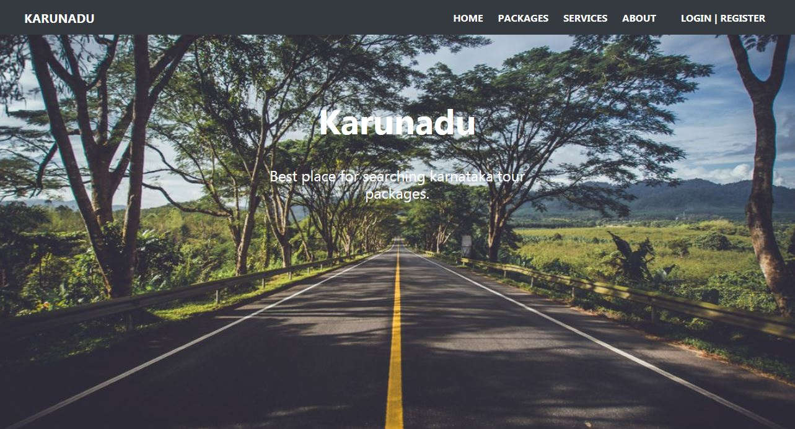 
  
  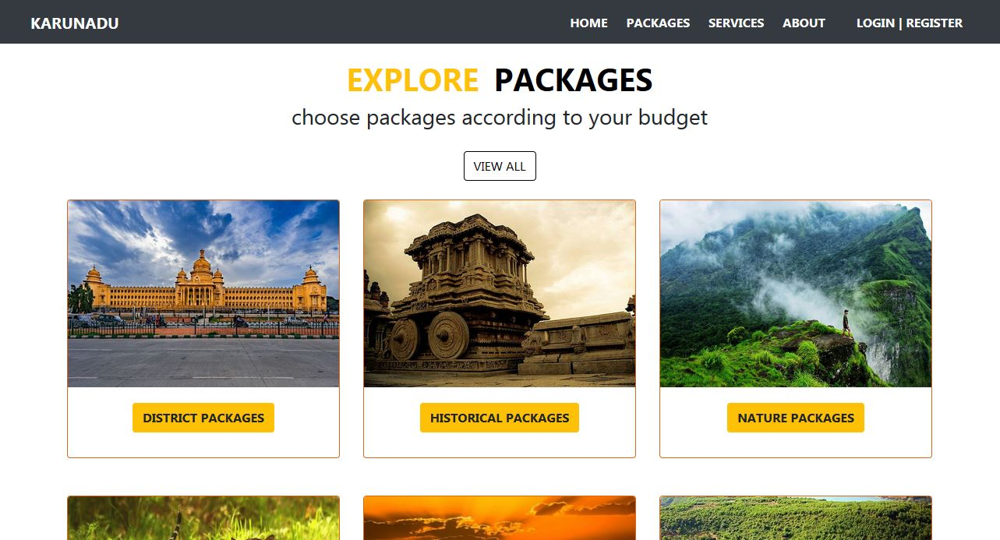
 
  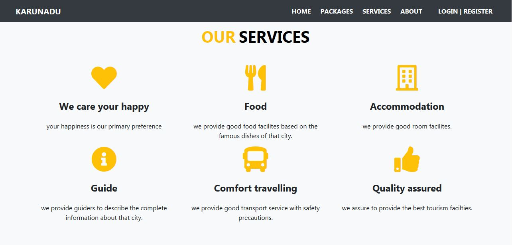 
 
  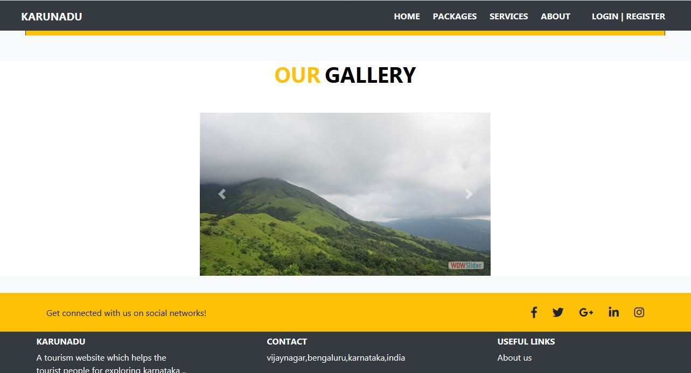

* Signup and Signin page

  signup
  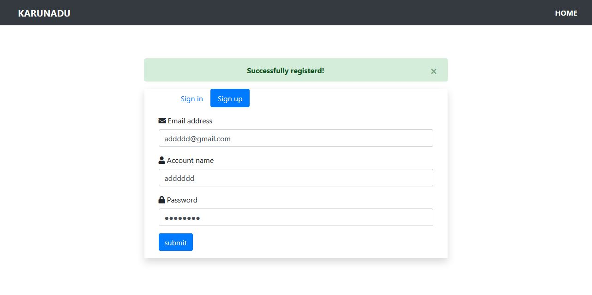

  signin
  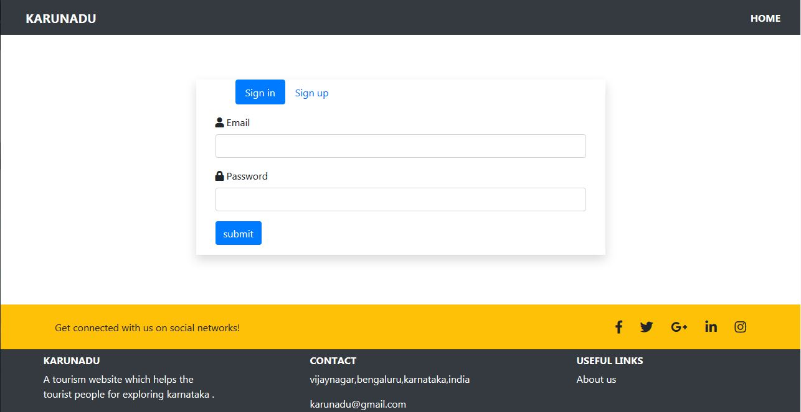

* Packages page

  All the packages basic information are retrieved from database and displayed. 
  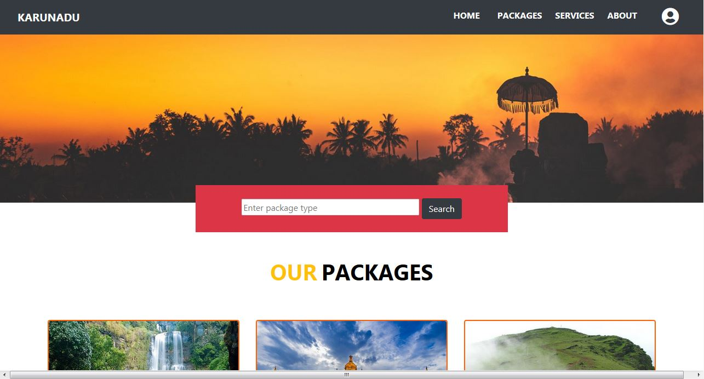
  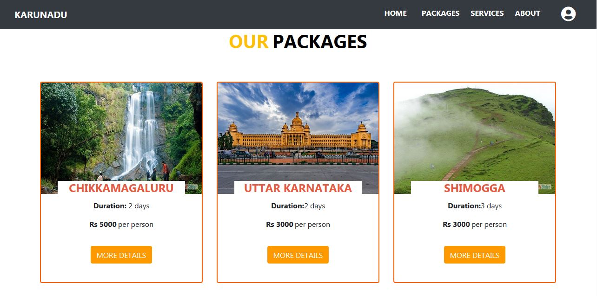

* Description page
  
  When user selects a package in package page then that package's complete information are retrieved from database and displayed.
  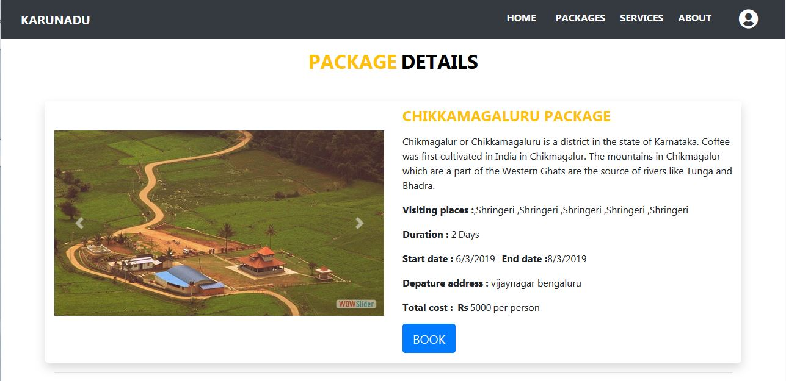

* Booking page
  
  When user clicks BOOK button in description page then page is loaded.
  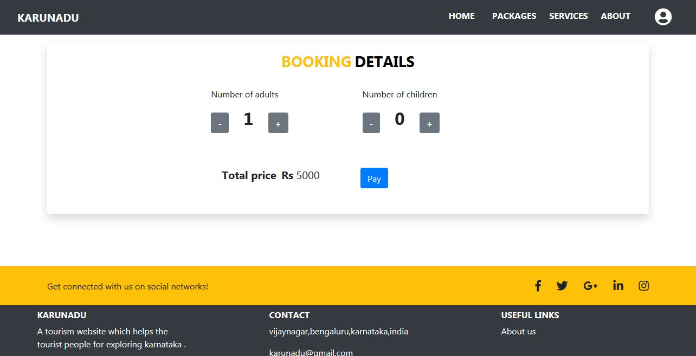
  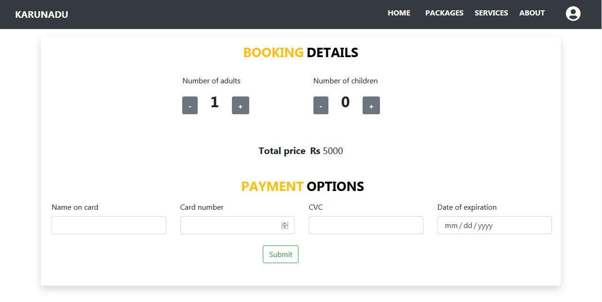

* User profile page
  
  This page is used for managing basic information about user
  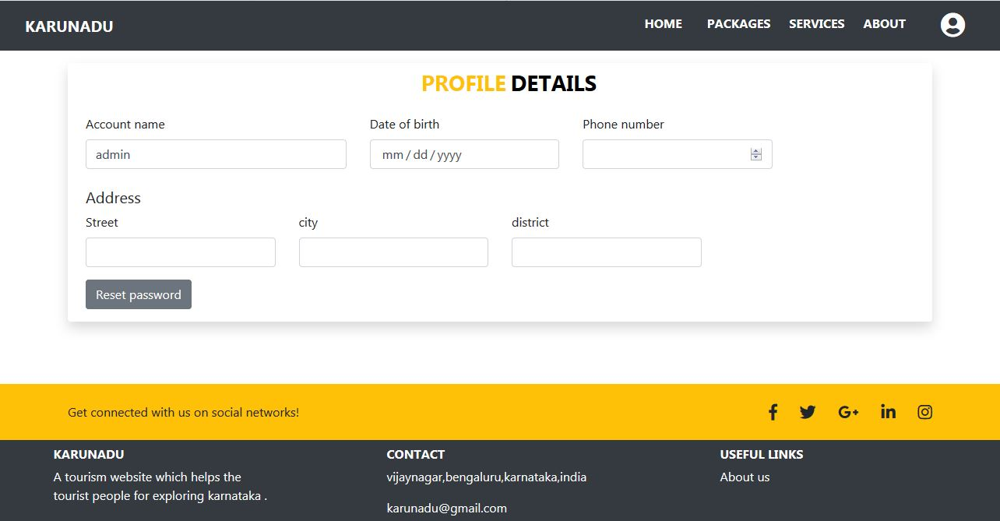

* User Booked packages details page
  
  This page displays the details about user booked packages and also controls cancellation process
  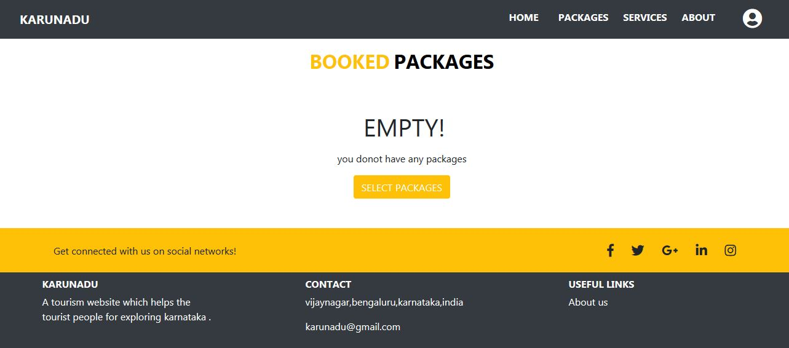
  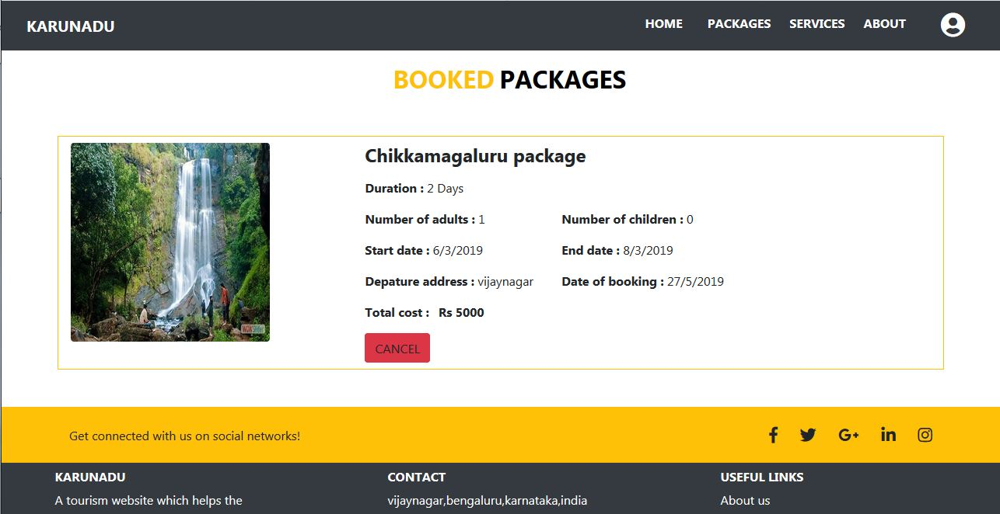

* About us page

  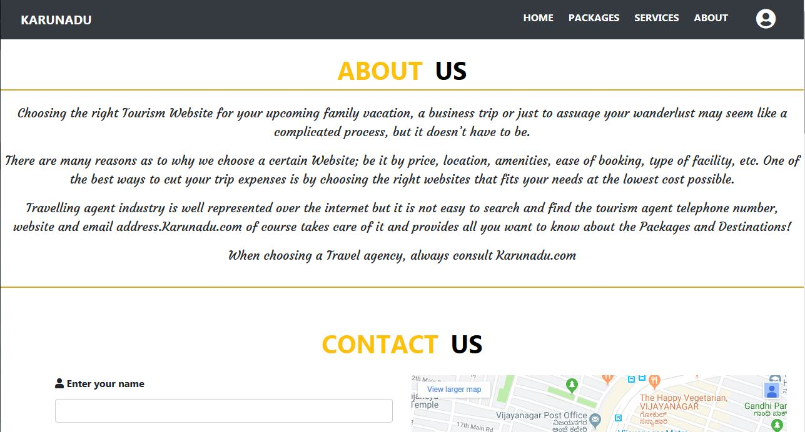
  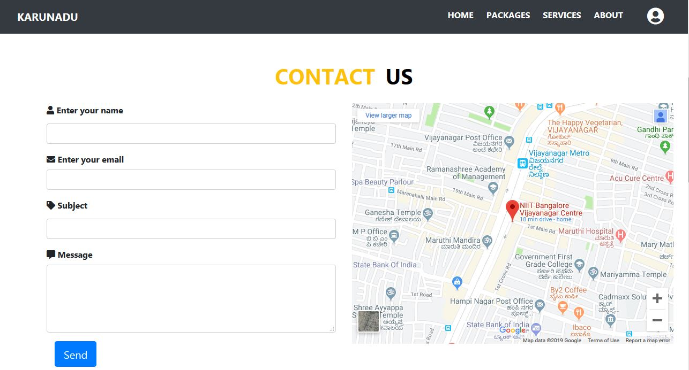

Thank you :grin:
